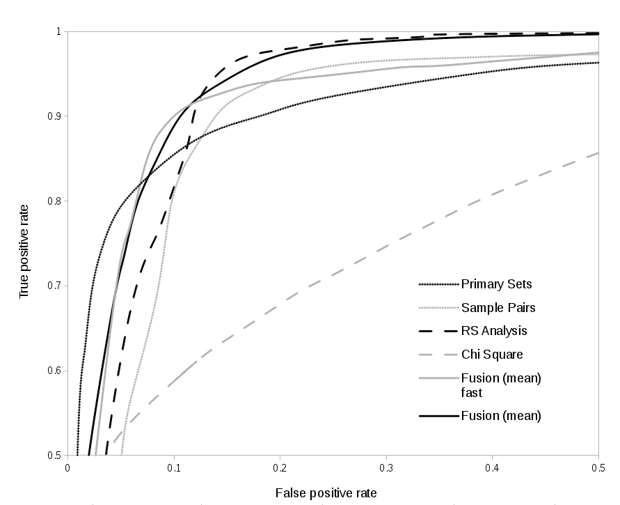

StegExpose
==========

Description
-----------
StegExpose is a steganalysis tool specialized in detecting LSB (least significant bit) steganography in lossless images such as PNG and BMP. It has a command line interface and is designed to analyse images in bulk while providing reporting capabilities and customization which is comprehensible for non forensic experts. StegExpose rating algorithm is derived from an intelligent and thoroughly tested combination of pre-existing pixel based staganalysis methods including Sample Pairs by Dumitrescu (2003), RS Analysis by Fridrich (2001), Chi Square Attack by Westfeld (2000) and Primary Sets by Dumitrescu (2002). In addition to detecting the presence of steganography, StegExpose also features the quantitative steganalysis (determining the length of the hidden message). StegExpose is part of my MSc of a project at the School of Computing of the University of Kent, in Canterbury, UK.

For more information, please download the research paper [here](http://arxiv.org/pdf/1410.6656v1.pdf)

Usage
-----
*java -jar StegExpose.jar [directory] [speed] [threshold] [csv file]*

where

*[directory]* - directory containing images to be diagnosed

*[speed]* - Optional. Can be set to 'default' or 'fast' (set to 'default if left blank). default mode will try and run all detectors whereas fast mode will skip the expensive detectors in case cheap detectors are able to determine if a file is clean.

*[threshold]* - Optional. The default value here is 0.2 (for both speed modes) and determines the the level at which files are considered to be hiding data or not. A floating point value between 0 and 1 can be used here to update the threshold. If keeping false positives at bay is of priority, set the threshold slightly higher ~0.25. If reducing false negatives is more important, set the threshold slightly lower ~0.15

*[csv file]* - Optional. Name of the csv (comma separated value) file that is to be generated. that If left blank, the program will simply output to the console. 

Example
------
Basic usage of Stegexpose, providing a directory of images as the only argument

*java -jar StegExpose.jar testFolder*

Produce a steganalytic report in the form of a csv file named 'steganalysisOfTestFolder'

*java -jar StegExpose.jar testFolder default default steganalysisOfTestFolder*

Updating the threshold and running the program in fast mode to save time.

*java - jar StegExpose testFolder fast 0.3*

Performance
-----------
The accuracy and speed of StegExpose has been tested on an image pool of 15,200 lossless images, where 5,200 of them were stego images (images with hidden data) created with the tools OpenStego, OpenPuff, SilentEye and LSB-Steganography. Embedding rates range from 2.5% to 25.3% with an average of 13.8% (secret data / cover image).

###Accuracy (ROC curves)
ROC or receiver operating characteristic curves expose the accuracy of a given signal. The curve below is used to demonstrate only the comparison between the the accuracy of StegExpose's fusion techniques (standard and fast) and the individual detectors it is derived from. Please note that the accuracy of each signal is very much dependant on the nature of the stego files they were tested on and can be a lot higher or lower depending on the embedding rate and method.

The area under the curves reveals that the standard fusion technique is the most accurate. The fast fusion technique is only slightly outperformed by standard fusion (1.6%) and RS analysis (0.2%). However, fast fusion does offer a clear advantage, as it 3.2 times faster than RS analysis and 3.5 times faster than standard fusion.

###Speed
A 460x460 pixel image will take **1.20** seconds to process in the default mode and **0.34** seconds in fast mode. However, the fast mode should be even faster in a real world environment, where there are a lot less stego files, allowing StegExpose to skip expensive detectors more frequently. 

Compilation
-----------
To recompile the source code and create a new executable jar file, the following commands should do the trick.

*javac -cp commons-math3-3.1.1.jar *.java*

*jar cfm StegExpose.jar manifest.mf *.class*

Bugs
----
Component detectors do not all generate results for all images. This bug is present in the reused source code listed below. This bug impacts the speed of the fast mode as well as the accuracy of both fast and standard modes of StegExpose.

Acknowledgements
--------
I would like to thank Julio Hernandez-Castro for supervising this project and coming up with the idea. Also, thank you Bastien Faure and Kathryn Hempstalk for publishing your source code.

